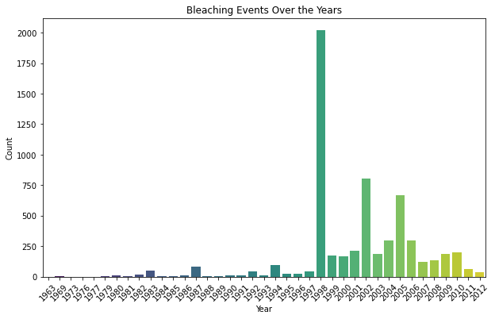
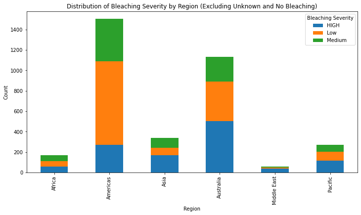
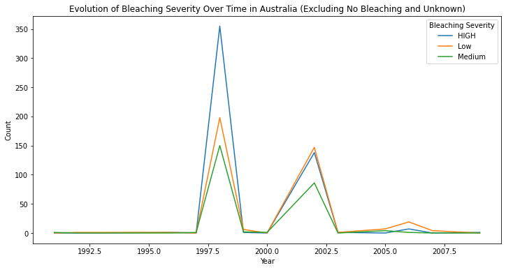
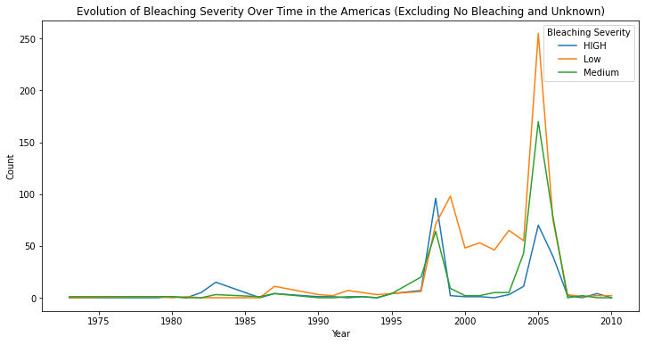

# Coral Bleaching Analysis Project

## Introduction

Coral reefs support 25% of marine creatures, despite covering less than 1% of the ocean floor. They are crucial for the environment and human society, providing various benefits such as food, shoreline protection, and tourism valued at 30 billion to 375 billion U.S. dollars annually. However, over the years as the earth warms, they have been significantly impacted by coral bleaching.

Coral bleaching is a phenomenon where corals lose their vibrant colors due to stress, often caused by environmental factors such as increased sea temperatures. This project aims to analyze coral bleaching events using a dataset containing information about bleaching severity, location, and time. Understanding coral bleaching trends is crucial for assessing the health of coral reefs and guiding conservation efforts.

## Data Preparation

The dataset, ReefBase, 2016, "Coral Bleaching Data", https://doi.org/10.7910/DVN/KUVQKY, retrieved from Harvard Dataverse, used in this analysis contains information about coral bleaching events, included several  the severity of bleaching, location (region and coordinates), and the year of occurrence. Before conducting the analysis, the dataset underwent several cleaning steps to ensure data quality:

1. **Handling Missing Values:**
   - Columns with missing values were identified.
   - Rows containing missing values in essential columns such as region, subregion, location, bleaching severity, severity code, latitude, and longitude were dropped to maintain data integrity.

2. **Cleaning Process:**
   - Irrelevant columns were dropped from the dataset to focus on essential variables.
   - Duplicate entries were removed to avoid redundancy.
   - Inconsistent data formats were standardized for uniformity.

3. **Data Subset:**
   - The cleaned dataset was further refined to include only relevant columns, such as region, subregion, location, bleaching severity, severity code, latitude, and longitude.

4. **Data Export:**
   - The cleaned dataset was exported to a new Excel file for further analysis.

## Data Analysis (EDA)

The data was first examined and the summary statitics were noted before advancing to more inferential data, which included temporal analysis and spatial analysis. 

## Temporal Analysis

A temporal analysis was conducted to investigate coral bleaching trends over time. The analysis included the breakdown of bleaching severity levels and comparisons over the years. By analyzing temporal trends, insights were gained into the changing patterns of coral bleaching events. It was noted that there was a significant event of coral bleaching in 1998.

To better understand the coral bleaching event by region, the distrbution by region and severity was plotted and it was noted that the Americas and Australia were the regions with the largest occurence of coral bleaching. With Australia recording the most occrences of bleaching at a high level and the Americas with the most occurences of bleaching at a low level. 

Another temporal analysis was conducted to assess the occrences of bleaching over time for both regions. Australia had a pique in bleaching, based on the dataset in beterrn 1997 and 1998, which aligned with global trends.

However, the pique of bleaching in the Americas was noted to take place between 2006 and 20007. 

## Spatial Analysis

A spatial analysis was conducted to visualize coral bleaching events geospatially. Using the cleaned dataset, maps were generated to illustrate the distribution of bleaching severity levels first globally and then the two regions which based on the dataset had the largest occurences of bleaching were mapped, the Americas and Australia. It was noted that while both regions have expereinced significant coral bleaching, the Americas has had a lot of corals with low bleaching severity, as opposed to Australia which had more occurences of high coral bleaching. Additionally

## Conclusion

In conclusion, this analysis provided valuable insights into coral bleaching trends and patterns. By examining both temporal and spatial aspects of coral bleaching events, this project contributes to our understanding of coral reef health and informs conservation efforts. Continued monitoring and conservation strategies are essential to mitigate the impacts of coral bleaching and preserve these vital marine ecosystems.

## Future Directions

Potential future directions for this project include conducting more detailed analyses on specific regions or exploring the drivers of coral bleaching events. Additionally, integrating additional datasets, such as oceanographic data or coral health indicators, could enhance the analysis and provide a more comprehensive understanding of coral reef dynamics. Continued research and collaboration are needed to address the ongoing threats to coral reefs and promote their long-term sustainability.
